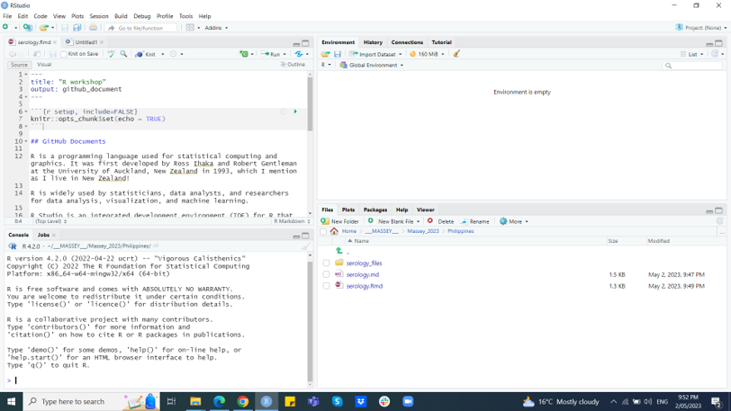

```{r setup, include=FALSE}
knitr::opts_chunk$set(echo = TRUE)
```

## Session 1

**Session 1** contains an introduction to R and R Studio, data types and data manipulation in R, and a brief introduction to plotting in base R.

### Session 1a - Introduction to R and R Studio
R is widely used by statisticians, data analysts, and researchers for data analysis, visualization, and machine learning.

R is a programming language used for statistical computing and graphics. It was first developed by Ross Ihaka and Robert Gentleman at the University of Auckland, New Zealand in 1993, which I mention as I live in New Zealand! It is free to use and, if you know what you are doing, you can contribute to it. There are currently nearly 20,000 **packages** that people have written to do specific tasks. You can see how many here: https://cran.r-project.org/web/packages/

R Studio is an integrated development environment (IDE) for R that provides a more user-friendly interface for working with R. R Studio is a powerful tool that simplifies the process of writing R code and analyzing data. It includes features such as code highlighting, debugging, and data visualization.

The first step is downloading and installing the software. You can download R from https://www.r-project.org/ and RStudio and R from https://posit.co/download/rstudio-desktop/

You should now be able to open RStudio and see a screen like this:


Spend a bit of time familiarizing yourselves with this screen and we will talk through this later.

### Beginning 

We will start by opening RStudio and begin with some of the most basic things about R. Here are some of the most basic R functions.

The **print()** function is used to display the value of an object or variable on the console. For example,

```{r}
print("Hello, world!") 
```

The **c()** function is used to create a *vector* of values. For example,

```{r}
c(1, 2, 3)
```

creates a vector containing the values 1, 2, and 3.

The **length()** function is used to determine the length of a vector or the number of elements in an object. For example,

```{r}
length(c(1, 2, 3))
```

returns the number 3 because there are three numbers.

The **sum()** function is used to calculate the sum of a vector or a set of numbers. For example, 

```{r}
sum(c(1, 2, 3))
```

will return 6.

The **mean()** function is used to calculate the mean or average of a vector or a set of numbers. For example, 

```{r}
mean(c(1, 2, 3))
```
will return 2.

Note that some functions like **mean()** need certain conditions to be true before they can work. Let's take a closer look at this example:

```{r}
n1 <- c(1,2,3,4,5)
n2 <- c(1,2,3,4,NA)
mean(n1)
mean(n2)
```

*n2* includes an **NA**, which means Not Available, and so the function mean() cannot calculate the mean. We can easily resolve that here because mean() has a *logical* condition that we will learn more about later, but here it is *na.rm = FALSE*. We include that and get a different answer:

```{r}
n2 <- c(1,2,3,4,NA)
mean(n2, na.rm = TRUE)
```

The **sd()** function is used to calculate the standard deviation of a vector or a set of numbers. For example, 

```{r}
sd(c(1, 2, 3, 4))
```

will return 1.290994.

The **var()** function is used to calculate the variance of a vector or a set of numbers. For example, 

```{r}
var(c(1, 2, 3, 4))
```

will return 1.666667.

The **seq()** function is used to create a sequence of numbers. For example, 
```{r}
seq(1, 5, by = 1)
```
will create a vector containing the numbers 1, 2, 3, 4, and 5. 

And the **rep()** function is used to repeat a value or a set of values a specified number of times. For example, 

```{r}
rep(1, times = 3)
```

will create a vector containing the values 1, 1, and 1.

The **plot()** function is used to create a plot of data. For example, 

```{r}
plot(c(1, 2, 3, 4), c(4, 5, 6, 7))
```

will create a scatter plot of the points (1, 4), (2, 5), (3, 6) and (4, 7).

Now, R comes with some built in data sets as well as functions. We can use another function, **summary()** to see what is in one called *cars*:

```{r cars}
summary(cars)
```

And we can use this *base* plot function again to plot some of the data, for example:

```{r pressure, echo=FALSE}
plot(pressure)
```

This plot looks slightly better than our first attempt with the six numbers above, but we can make this look better. Here's an example of how:

```{r}
plot(c(1, 2, 3, 4), c(4, 5, 6, 7), col = "blue", lwd = 10,
     main = "Main title", xlab = "Number set 1", ylab = "Number set 2")
```

Last, in this mini session, we will *simulate* some data and plot it in **ggplot** to show you how where this is going:

```{r}
# Simulate data
set.seed(123) # Set seed for reproducibility
data <- rnorm(1000, mean = 50, sd = 10)

# Plot histogram
library(ggplot2)
ggplot(data.frame(x = data), aes(x)) +
  geom_histogram(bins = 30, fill = "blue", color = "white") +
  labs(x = "Data", y = "Count", title = "Histogram of Simulated Data")
```

Do not worry about the **ggplot** text for now, we will have a session on this.

### Getting help in R

**Google** is your friend! I use Google a lot for coding. However, there are some great resources, some of which are included in the *README* file on the Github page for this, but not least https://www.r-project.org/help.html

Basic help can be found in several ways within R though. This includes typing the function name in the **search** box in the **help** tab in **RStudio** or using the R help functions **help()** or simply *?*. For example,

```{r}
# help(lm)
```

takes you to a server or

```{r}
#?lm
```

### Packages in R

In R, a package is a collection of functions, data sets, and other resources that extend the functionality of the base R software. R packages can be downloaded and installed from a variety of sources, including the Comprehensive R Archive Network (CRAN), Bioconductor, GitHub, and other online repositories.

R packages allow users to perform a wide range of specialized tasks in R, from data visualization to statistical analysis to machine learning. Some popular R packages include **ggplot2** for creating visualizations, **dplyr** for data manipulation, **tidyr** for data cleaning, and **caret** for machine learning.

Packages in R are typically installed using the **install.packages()** function, and loaded into the R session using the **library()** function. . For example,

```{r}
# Check if ggplot2 is already installed
if(!require(ggplot2)){install.packages("ggplot2")}

# Load ggplot2 library
library(ggplot2)
```
Checks to see if the package is installed or not with the **require()** function and installs it if not with the **install.packages()** function, then loads the library for use using the **library()** function. 

Once a package is loaded, its functions and data sets can be accessed using the package name followed by the function or data set name, separated by a period (e.g., ggplot2::ggplot()).

In addition to the packages available on public repositories, users can also create their own R packages to share their code with others or to organize their own workflows. R packages typically include documentation to explain the package's functions and usage, making it easier for others to use and contribute to the package.

### Session 1b - Data types and data manipulation in R

R has several **data types** that are used to store and manipulate data. What follows are some of the most commonly used data types in R. We will use a few new functions as we go through this and introduce them as we go.

**Numeric** data represent real numbers and are used to store continuous numerical data, such as measurements or counts. For example,

```{r}
# Simulate data
set.seed(123) # Set seed for reproducibility
data <- rnorm(5, mean = 10, sd = 2)

# Print data
print(data)

```

In this script, **rnorm()** is used to simulate a normal distribution with a mean of 10 and a standard deviation of 2, generating 5 random values. The **set.seed()** function is used to ensure reproducibility of the results. The **print()** function is one we already learned above and used to display the generated data in the console.

You can modify the parameters of **rnorm()** to generate different types of data sets with different distributions and parameters.

**Integer** data represent *whole numbers* and are used to store discrete numerical data, such as counts or indices. For example,

```{r}
# Simulate data
set.seed(123) # Set seed for reproducibility
data <- sample(1:10, 5, replace = TRUE)

# Print data
print(data)
```

In this script, **sample()** is used to randomly select 5 *integers* from the range of 1 to 10 with replacement. The **set.seed()** and **print()** functions are used to ensure reproducibility of the results and display the results as before. 

You can modify the parameters of **sample()** to generate different types of data sets with different ranges and sizes.

**Character** data types in R represent *strings* of text and are used to store categorical or textual data. For example,

```{r}
# Simulate data
data <- c("red", "blue", "green", "yellow", "orange")

# Print data
data

```

In this script, a **character** *vector* is created with 5 different color names. Note that here we printed the data without using the **print()** function. This is a common short cut.

You can have a string of any words or numbers written as words as long as they are in quotation marks (`` ``).

**Logical** data types in R represent *Boolean* values (i.e. only two values) and are used to store binary data, such as **true/false** values or logical conditions. For example,

```{r}
# Define logical variables
var1 <- TRUE
var2 <- FALSE

# Define a logical vector
vector1 <- c(TRUE, FALSE, TRUE, FALSE, TRUE)

# Perform logical functions
result1 <- any(vector1) # returns TRUE if any element in vector1 is TRUE
result2 <- all(vector1) # returns TRUE if all elements in vector1 are TRUE
result3 <- xor(var1, var2) # returns TRUE if either var1 or var2 is TRUE, but not both

# Print results
print(result1)
print(result2)
print(result3)
```

In this script, two **logical** variables *var1* and *var2* are defined with the values **TRUE** and **FALSE**, respectively. A logical vector *vector1* is also defined with 5 values.

Three logical functions are then performed:

The **any()** function checks if any element in *vector1* is **TRUE** and returns a logical value. The result is saved in the *result1* variable.
The **all()** function checks if all elements in *vector1* are **TRUE** and returns a logical value. The result is saved in the *result2* variable.
The **xor()** function checks if either *var1* or *var2* is **TRUE**, *but not both*, and returns a logical value. The result is saved in the *result3* variable.

Next, we will try a different way of looking at this:

```{r}
# Define logical variables
var1 <- TRUE
var2 <- FALSE

# Print logical variables
print(var1)
print(var2)

# Create logical vector
vector1 <- c(TRUE, FALSE, TRUE, FALSE, TRUE)

# Print logical vector
print(vector1)

# Perform logical operations
result1 <- var1 & var2 # AND operator
result2 <- var1 | var2 # OR operator
result3 <- !var1 # NOT operator

# Print results
print(result1)
print(result2)
print(result3)

```

In this script, **logical** variables *var1* and *var2* are defined with the values **TRUE** and **FALSE**, respectively. The **print()** function is used as before.

A **logical** vector *vector1* is then created with 5 values.

**Logical** operations are then performed using the **&** (AND), **|** (OR), and **!** (NOT) operators on the logical variables. The print() function is used to display the results of the logical operations.

This can sometimes cause some confusion, so let's try with another **last example** of logical conditions:

```{r}
# Define variables
var1 <- 10
var2 <- 5

# Perform logical conditions
result1 <- var1 > var2 # asks if var1 is greater than var2
result2 <- var1 < var2
result3 <- var1 == var2
result4 <- var1 != var2

# Print results
print(result1)
print(result2)
print(result3)
print(result4)
```

In this script, two *variables* *var1* and *var2* are defined with the values 10 and 5, respectively.

Note that we can check the type of data these variables are by using the **class()** function.

```{r}
class(var1)
class(var2)
```

**Logical** conditions are then performed using the **>**, **<**, **==**, and **!=** operators on the variables. The **>** operator checks if *var1* is greater than *var2*, the **<** operator checks if *var1* is less than *var2*, the **==** operator checks if *var1* is equal to *var2*, and the **!=** operator checks if *var1* is not equal to *var2*. The results of each condition are saved in separate variables *result1*, *result2*, *result3*, and *result4*.

**Factor** data types in R represent categorical data with a fixed set of levels. Factors are often used to represent categorical variables in statistical analyses. For example:

```{r}
# Define a factor variable
var1 <- factor(c("A", "B", "A", "C", "B", "B", "C", "C", "A"))

# Define a numeric variable
var2 <- c(10, 20, 15, 25, 30, 35, 23, 25, 12)

# Combine variables into a data frame
df <- data.frame(var1, var2)

# Print the data frame
print(df)
```

In this script, a **factor** variable *var1* is defined with 6 values representing different levels: "A", "B", and "C". A numeric variable *var2* is also defined with 6 values.

The two variables are then combined into a **data frame** called *df* using the **data.frame()** function. We will discuss data frames below. Note we can plot this data set using:

```{r}
plot(df)
```

R has built-in data types for storing and manipulating **dates** and **times**. These data types are useful for time series analysis and data visualization.

```{r}
# Create a date sequence for the month of May 2023
dates <- seq(as.Date("2023-05-01"), as.Date("2023-05-31"), by = "day")

# Create a time sequence for the day, in 15-minute intervals
times <- seq(from = as.POSIXct("2023-05-01 00:00:00"), to = as.POSIXct("2023-05-01 23:45:00"), by = "45 min")

# Print the first 10 dates
print(head(dates, n = 10))
print(head(times, n = 10))

```

In this script, a *sequence* of **dates** is created using the **seq()** function, with the *start* and *end* dates specified using the **as.Date()** function. The **by** parameter is set to **"day"** to generate a sequence of dates, one for each day in May 2023.

A *sequence* of **times** is also created using the **seq()** function, with the *start* and *end* times specified using the **as.POSIXct()** function. The **by** parameter is set to **"15 min"** to generate a sequence of times, one for each 15-minute interval throughout the day.

The **head()** function is used to display the first 10 rows of the resulting data frame:

We can plot time and date data too. Here's an example of some code, simulating data from a different time period just to show you:

```{r}
# Generate some time data
time <- seq(as.POSIXct("2022-01-01 00:00:00"), as.POSIXct("2022-01-02 23:59:59"), by = "15 min")
value <- rnorm(length(time), mean = 50, sd = 10)
data <- data.frame(time, value)

# Plot the data using ggplot2
library(ggplot2)
ggplot(data, aes(x = time, y = value)) +
  geom_line() +
  scale_x_datetime(date_labels = "%H:%M")
```

This script first generates some time data using the seq function to create a sequence of 15-minute intervals between January 1st and January 2nd, 2022. The **rnorm()** function is then used to generate some random values for each time point. The data is then stored in a data frame called data.

The script then loads the **ggplot2** **library** and creates a plot of the data using **ggplot()**. We will cover ggplot later, but to start introducing the terms, the **aes()** function is used to specify that the x-axis should be the *time* variable and the y-axis should be the *value* variable. The **geom_line()** function is used to draw a line connecting the data points. Finally, the **scale_x_datetime()** function is used to format the x-axis labels as hours and minutes.

**Lists** in R are used to store complex or structured data, such as nested data frames or ''heterogeneous'' data sets.

```{r}
# Create a list
my_list <- list(
  name = "John Smith",
  age = 35,
  married = TRUE,
  hobbies = c("reading", "hiking", "cooking")
)

# Access elements of the list
my_list$name
my_list$age
my_list$married
my_list$hobbies

# Add an element to the list
my_list$new_element <- "This is a new element"

# Remove an element from the list
my_list$age <- NULL
```

**Arrays** and **matrices** in R are used to store data in two or more dimensions. These data types are often used in mathematical and statistical analyses.

```{r}
# Create a matrix
my_matrix <- matrix(1:9, nrow = 3, ncol = 3)
print(my_matrix)

# Access elements of the matrix
my_matrix[1, 1]
my_matrix[2, 3]

# Create an array
my_array <- array(1:27, dim = c(3, 3, 3))
print(my_array)

# Access elements of the array
my_array[1, 2, 3]
my_array[3, 1, 2]

```

In this script, a **matrix** is created using the **matrix()** function. The matrix contains the values 1 through 9, arranged in a 3x3 grid. The **nrow** and **ncol** arguments specify the number of rows and columns in the matrix, respectively. The matrix is then printed to the console using the print function.

The script demonstrates how to access elements of the matrix using indexing. The element in the first row and first column can be accessed using **my_matrix[1, 1]**, and the element in the second row and third column can be accessed using **my_matrix[2, 3]**.

The script also creates an **array** using the **array()** function. The array contains the values 1 through 27, arranged in a 3x3x3 cube. The dim argument specifies the dimensions of the array as a vector. The array is then printed to the console using the print function.

The script demonstrates how to access elements of the array using indexing like for the matrix. The element in the first row, second column, and third "layer" can be accessed using **my_array[1, 2, 3]**, and the element in the third row, first column, and second "layer" can be accessed using **my_array[3, 1, 2]**.

Lastly, **Data frames** in R are used to store tabular data with rows and columns, *similar to a spreadsheet*. Data frames are a fundamental data structure in R and are widely used in data analysis and statistical modeling. We have seen several examples of them before. Let's look at one of R's in-built data frames, called 'cars'.

```{r}
summary(cars)
head(cars)
dim(cars)
tail(cars)
plot(cars)
```

You should now be familiar with all the functions here, with the exception of **dim()** and **tail()**, which tell us the size of the data frame and show us the bottom of the data frame. 

Understanding these data types is crucial for working with data in R and performing statistical analyses. It is important to choose the appropriate data type for each variable based on the nature of the data and the desired analysis.
