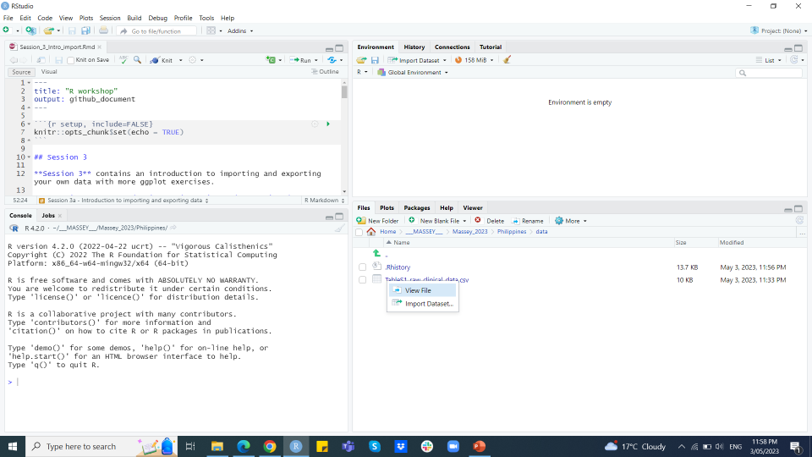

```{r setup, include=FALSE}
knitr::opts_chunk$set(echo = TRUE)
```
```{r klippy, echo=FALSE, include=TRUE}
library(klippy)
klippy::klippy('')
```

## Session 3

**Session 3** contains an introduction to **importing** and **exporting** your own data with more *ggplot* exercises.

### Session 3a - Introduction to importing and exporting data

#### Importing data

To import data, we need to first tell R where the data are and then import those data. 

Data are best stored as **.csv** files for our purposes, but R can handle many different source file types and these may be more appropriate, depending on what you are doing.

When you *download* a *GitHub repository*, like course we are using now, the files in the repository are downloaded to a *local directory* on your machine. To set the *working directory* *path* in an R script so that it finds the files after downloading the repository, you can use **relative paths**.

For example, in this repository we have a folder named *data* and it contains a *.csv* file named **TableS1_raw_clinical_data.csv**. You can set the **working directory** to the **data** folder using the relative path **./data** using the **setwd()** function like this:

```{r, class.source='klippy'}
# Set the working directory to the data folder in the downloaded repository
setwd("./data")

# Import the csv file
example_data <- read.csv("TableS1_raw_clinical_data.csv", header = TRUE)

# Print the head of the dataframe
head(example_data)
```

The **setwd()** function sets the working directory to the *data* folder in the downloaded repository, and the **read.csv()** function reads in the *TableS1_raw_clinical_data.csv* file from that folder. 

**Note that you'll need to change the relative path to match the location of the folder in your repository in the future**

For example, here's an example R script that imports a .csv file named *example_data.csv* from a folder named *data_folder* and converts it into a dataframe with headers. **Note that this will not work without editing.** Also, we are using the **#** symbol here to *comment* out the text so that it does not run. 

```{r, class.source='klippy'}
# Set the path to the data folder
#data_path <- "~/path/to/data_folder"

# Import the csv file
#example_data <- read.csv(paste0(data_path, "/example_data.csv"), header = TRUE)

# Print the dataframe
#print(example_data)
```

If we delete the *#* symbol and run it it will produce an error message.

But in this script, we first set the path to the data folder using the *data_path* variable. Then we import the *.csv* file using the **read.csv()** function as above and specify the full path to the file using **paste0()** which combines the first path (the *data_path* variable) to the actual data set we want (here, *example_data.csv*).

Note that you can also directly import the data using RStudio, as in this image:


Next we are going to work with the data we just imported. 

The data we imported came from a paper, *SARS-CoV-2 integral membrane proteins shape the serological responses of COVID-19 patients* by Martin et al. The data are in the folder that comes with this workshop git repository, but you can find the paper here: https://doi.org/10.1016/j.isci.2021.103185 and the data here:
https://data.mendeley.com/datasets/69tvkst9ct/1 

This is the type of data we will be collecting during this project, except that they are from people and not bats.

Let's look at the data, using two alternative ways:

```{r, class.source='klippy'}
str(example_data)

library(dplyr) # load the dplyr package
glimpse(example_data)
```

Both ways show us several things. First, that the columns have names we might want to change. Second, that some of the variables in the columns are the wrong data types. For example, *Date.of.birth* is a *character* but we would like it as a *date*. 

You can tell what data type these are by the **<****int****>** for integer in the **glimpse()** example or just **int** in the **str()** example. **<****fct****>** and **Factor** are another example.

To change the data type of a column in a newly imported data frame using tidyverse, you can use the **mutate()** function from the *dplyr* package.

Here's an example of how to change the data type of the *Sex* column to a *factor* and check it using the **glimpse()** function:

```{r, class.source='klippy'}
library(dplyr)
example_data <- mutate(example_data, Sex = as.factor(Sex))
glimpse(example_data)
```

Here we used the **as.factor()** function, but you can modify this code to change the data type of other columns in the data frame as needed, and use other data type conversion functions such as **as.numeric()**, **as.character()**, etc.

To change a column name in a data frame using tidyverse, you can use the **rename()** function from the *dplyr* package.

Here's an example of how to use **rename()** to change the name of a column named *X.Patient* to just *Patient* in the *example_data*:

```{r, class.source='klippy'}
library(dplyr)
example_data <- rename(example_data, Patient = X.Patient)
glimpse(example_data)
```

The *X.* was added by R to fill a space the is carried over from the original Excel file this was copied from. This is not uncommon, so it's good to have the data fields as clean as possible.

Note that you can also use **rename()** to change multiple column names at once, by specifying multiple arguments in the format below.

```{r, class.source='klippy'}
library(dplyr)
example_data <- example_data %>%
  rename_with(~ "new_name1", "IgA_S") %>%
  rename_with(~ "new_name2", "IgA_E") %>%
  rename_with(~ "new_name3", "IgA_M")
glimpse(example_data)
```

Let's switch them back because the original names were more useful:

```{r, class.source='klippy'}
library(dplyr)
example_data <- example_data %>%
  rename_with(~ "IgA_S", "new_name1") %>%
  rename_with(~ "IgA_E", "new_name2") %>%
  rename_with(~ "IgA_M", "new_name3")
glimpse(example_data)
```

Now let's now change another single column that we actually want to change:

```{r, class.source='klippy'}
example_data <- rename(example_data, Cohort = X.Cohort)
```

Note we could have done that all in one go!

The names are now tidy, but we still have several columns in the wrong *type*. Let's start to change them. To change the data types of several columns using **mutate()** in R, you can use the **mutate_at()** or **mutate_if()** functions from the **dplyr** package.

```{r, class.source='klippy'}
library(dplyr)
# Convert columns "Cohort", "Result.Beckman", and "Result.Roche" to factor data type
example_data <- example_data %>%
  mutate_at(vars("Cohort", "Result.Beckman", "Result.Roche"), as.factor)

# Print the modified dataframe
glimpse(example_data)

```

There are some columns that should be numbers, but are not. Let's look at one:

```{r, class.source='klippy'}
print(example_data$Total.Ab.Roche)
```

These data are in the wrong format because of the "-" symbols, so R thinks that these should be characters. Let's convert them to numerical values:

```{r, class.source='klippy'}
example_data <- mutate(example_data, Total.Ab.Roche = as.numeric(Total.Ab.Roche))
```

Note that you get a **warning**, but this is fine. This is warning us that there are **NA**s. These are fine and telling us that we have missing data (the - in the above).

```{r, class.source='klippy'}
print(example_data$Total.Ab.Roche)
```
Let's look at the format of what is left:

```{r, class.source='klippy'}
glimpse(example_data)
```

Let's change the last things we want to be numeric values:

```{r, class.source='klippy'}
example_data <- example_data %>%
  mutate_at(vars("Time.from.symptoms.to.blood.sample", "IgG.Beckman"), as.numeric)
```

Now we are just left with the dates. Dates can be tricky, but let's use the **mutate_at()**. To convert character columns to date format using **mutate_at()** where the character is in the *"dd/mm/yyyy"* format, you can use the **as.Date()** function with the appropriate date format string. For example:

```{r, class.source='klippy'}
library(dplyr)
example_data <- example_data %>%
  mutate_at(vars("Date.of.birth","Date.of.symptoms","Date.of.PCR.test","Date.of.blood.sample"), ~ as.Date(., format = "%d/%m/%Y"))

glimpse(example_data)
```

Now we have the data ready for analyses. We will start with some plotting.

### Session 3b - ggplot exercises using real data

Personally, I think plotting data is extremely helpful. It tells us so much and helps make sure that the data are as we expect, plus it tells us what we might see in the analyses, even before we have performed them. Plotting your data can also help you identify if you have errors in your analyses, because you might get a result that is unexpected. This might be a real result or an error.

*Note that in this section, like others, we are not necessarily always going to use the most useful plot for the data, because this is a workshop and we are using these as training material and exercises.*

Let's start by plotting one of the antibody titres by date, just to start:

```{r, class.source='klippy'}
library(ggplot2)
ggplot(example_data, aes(x = Date.of.symptoms, y = IgG_S)) +
  geom_line()
```

The data of the symptoms may not be useful. Plus, because these data are from different patients they should not be plot as a line like this.

Now let's plot something slightly more meaningful, the time from the symptoms a patient reported to a blood sample with the titre, and use a better plot method for these data:

```{r, class.source='klippy'}
library(ggplot2)
ggplot(example_data, aes(x = Time.from.symptoms.to.blood.sample, y = IgG_S)) +
  geom_point()
```

Do these results make sense to you?

Now what about age? Let's plot the antibody data by age.

```{r, class.source='klippy'}
library(ggplot2)
ggplot(example_data, aes(x = Age, y = IgG_S)) +
  geom_point()
```

And what do the titres look like by gender (here classified as *Sex*):

```{r, class.source='klippy'}
library(ggplot2)
ggplot(example_data, aes(x = Sex, y = IgG_S)) +
  geom_point()
```

#### Box and violin plots

There are better ways of plotting these data that give us more information, so let's try a box plot using the **geom_boxplot()** instead of the **geom_point()** function:

```{r, class.source='klippy'}
library(ggplot2)
ggplot(example_data, aes(x = Sex, y = IgG_S)) +
  geom_boxplot()
```

And now let's look at a violin plot with **geom_violin()**

```{r, class.source='klippy'}
library(ggplot2)
ggplot(example_data, aes(x = Sex, y = IgG_S)) +
  geom_violin()
```

Now we can add some more information and change the looks. We will add more and then break this down:

```{r, class.source='klippy'}
# Libraries
library(ggplot2)
library(dplyr)
library(hrbrthemes)
library(viridis)

sample_size = example_data %>%
  group_by(Sex) %>% summarize(num=n())

example_data %>%
  left_join(sample_size) %>%
  mutate(myaxis = paste0(Sex, "\n", "n=", num)) %>%
  ggplot( aes(x=myaxis, y=IgG_S, fill=Sex)) +
    geom_violin(width=0.75) +
    geom_boxplot(width=0.1, color="grey", alpha=0.5) +
    scale_fill_viridis(discrete = TRUE) +
    theme_ipsum() +
    theme(
      legend.position="none",
      plot.title = element_text(size=11)
    ) +
    ggtitle("A 'Violin' wrapping a boxplot of the IgG S data, coloured by 'Sex' ") +
    xlab("") +
  ylab("IgG S")
```

We will now break this down. You do **not** need to learn this now, this is just to help see how code works:

* *example_data %>%* is the data set name and uses the *pipe* symbol (%>%) to say what to do with it and tell R that there is more to come.

* *left_join(sample_size) %>%* uses the **left_join()** function, which is used to combine two data frames based on a common column, keeping all the rows from the left data frame and adding matching rows from the right data frame.

* *mutate(myaxis = paste0(Sex, "\n", "n=", num)) %>%* uses the **mutate()** function and the **paste()** function to create a new column with the *Sex* data and the number of those.

* *ggplot(aes(x=myaxis, y=IgG_S, fill=Sex)) +* uses **ggplot()** function and the *aes()* function to tell R what data to plot. The *x* is the x axis, *y* the y axis, and *fill* the data to classify and colour the plot by. The **+** is to tell R there is more to come.

* *geom_violin(width=0.75) +* uses the **geom_violin()** function to tell R which type of plot to plot, here a Violin plot.

* *geom_boxplot(width=0.1, color="grey", alpha=0.5) +* tells R we also want a *boxplot* by using the **geom_boxplot()** function. The *width=0.1, color="grey", alpha=0.5* tells R the *width* of the plot, the *color* of the plot, and *alpha* the opacity of the plot.

* *scale_fill_viridis(discrete = TRUE) +* tells R to use a different colour scheme using the **scale_fill_viridis()** function.

* *theme_ipsum() +* tells R to use a plot *theme* so changes the background colour of the plot using the **theme_ipsum()** function.

* *theme(legend.position="none", plot.title = element_text(size=11)) +* tells R to drop (remove) the legend by saying the position is *none* and specifies the font size of the title using the **theme()** function.

* *ggtitle("A 'Violin' wrapping a boxplot, coloured by 'Sex' ") +* tells R the title using the **ggtitle()** function.

* *xlab("") +* tells R to remove the x-axis label using the **xlab()** function

And 

* *ylab("IgG S")* tells R to call the y-axis label *IgG S* using the **ylab()** function.

Next, let's simplify things a bit more, but make four plots, all with some minor differences to the plots.

```{r, class.source='klippy'}
library(ggplot2)
# Basic box plot
p1 <- ggplot(example_data, aes(x=Sex, y=IgG_S, fill=Sex)) + 
  geom_boxplot()

p2 <- ggplot(example_data, aes(x=Sex, y=IgG_S, fill=Sex)) + 
  geom_boxplot(outlier.colour="red", outlier.shape=8,
                outlier.size=1)

p3 <- p1 + geom_dotplot(binaxis='y', stackdir='center', dotsize=1)

p4 <- p1 + geom_jitter(shape=16, position=position_jitter(0.1))

```

We can now plot these together using the **ggarrange()** function from the **ggpubr** package.

```{r, class.source='klippy'}
library(ggpubr)
ggarrange(p1, p2, p3, p4, 
          labels = c("A", "B", "C", "D"),
          ncol = 2, nrow = 2)
```

Spend a bit of time looking at the different plots and the code that made them and try making changes and re-running the code with them to see what changes.

#### Histogram and density plots

We can change the type of plot to a *histogram* by using the **geom_histogram()** function instead of the **geom_violin()** or **geom_boxplot()** functions above. Let's look:

```{r, class.source='klippy'}
library(ggplot2)
ggplot(example_data, aes(x=Total.Ab.Roche)) + 
  geom_histogram(binwidth=1)

```

We can change details like we did above for other plots. For example:

```{r, class.source='klippy'}
# Draw with black outline, white fill
ggplot(example_data, aes(x=Total.Ab.Roche)) +
    geom_histogram(binwidth=.5, colour="black", fill="white")
```

Now let's look at a density plot:

```{r, class.source='klippy'}
# Density curve
ggplot(example_data, aes(x=Total.Ab.Roche)) + 
  geom_density()
```

And we can overlay these, like we combined the box plot and the violin plots above:

```{r, class.source='klippy'}
# Histogram overlaid with kernel density curve
ggplot(example_data, aes(x=Total.Ab.Roche)) + 
    geom_histogram(aes(y=after_stat(density)),   # Histogram with density instead of count on y-axis
                   binwidth=.5,
                   colour="black", fill="white") +
    geom_density(alpha=.2, fill="#FF6666")  # Overlay with transparent density plot
```

#### Scatter plots

There are nice ways that we can look at all the data. Let's take a look at all the antibody data. Let's remind ourselves of which and numeric antibody data:

```{r, class.source='klippy'}
glimpse(example_data)
```

Now let's look and the relationships between the different **antibody titre** data. Here where have the different immunoglobulins (*IgG*, *IgM* and *IgA*) against the different SARS-CoV-2 proteins (*S* for *spike*, *E* for *envelope*, and *M* for membrane) and the different test kits (*Beckman* and *Roche*)

```{r, class.source='klippy'}
#install.packages("GGally")
library(ggplot2)
library(GGally)

graph_corr <- ggpairs(example_data, mapping = aes(color = Sex),
                      columns = c('IgG.Beckman', 
                                  'Total.Ab.Roche',
                                  'IgG_S',
                                  'IgG_E',
                                  'IgG_M',
                                  'IgM_S',
                                  'IgM_E',
                                  'IgM_M',
                                  'IgA_S',
                                  'IgA_E',
                                  'IgA_M'), 
                      columnLabels = c('IgG.Beckman', 
                                  'Total.Ab.Roche',
                                  'IgG_S',
                                  'IgG_E',
                                  'IgG_M',
                                  'IgM_S',
                                  'IgM_E',
                                  'IgM_M',
                                  'IgA_S',
                                  'IgA_E',
                                  'IgA_M')) 
graph_corr <- graph_corr + theme_minimal()
graph_corr
```

That's big plot with a lot of interactions, so let's simplify it further and just look at those are include IgG:

```{r, class.source='klippy'}
library(ggplot2)
library(GGally)

graph_corr <- ggpairs(example_data, mapping = aes(color = Sex),
                      columns = c('IgG.Beckman', 
                                  'Total.Ab.Roche',
                                  'IgG_S',
                                  'IgG_E',
                                  'IgG_M'), 
                      columnLabels = c('IgG.Beckman', 
                                  'Total.Ab.Roche',
                                  'IgG_S',
                                  'IgG_E',
                                  'IgG_M')) 
graph_corr <- graph_corr + theme_minimal()
graph_corr
```

This type of plot can be very helpful to look at before plotting specific relationships. Of course, plotting data like this can be part of **data dredging** or **p-hacking**, which is the misuse of data analyses to find patterns in data that are statistically significant, increasing the risk of false positives. To avoid that, a simple way to to make sure that there are biologically plausible reasons for you to hypothesize that a variable has an effect on another and to have a well-designed study.

Let's have a look at how gender (here *Sex*) impacts *IgG* antibodies against the *M* protein using another type of plot, a *ridgeline* plot:

```{r, class.source='klippy'}
library(ggplot2)
library(ggridges)
theme_set(theme_minimal())
ggplot(example_data, aes(x = IgG_M, y = Sex)) + 
  geom_density_ridges(scale = 0.6)
```

And last for this session, let's plot the different antibodies types (*IgG*, *IgM*, *IgA*) against the spike protein (*S*) through time. For this, we have to do some data manipulation.

First, for *ggplot* we must convert the **wide format** data to **long format** data before plotting it, because to plot these data in ggplot, we need to **reshape** the data so that each row contains a single observation of the variable at a given time point. To do this, we can use the **gather()** function from the **tidyr** package:

```{r, class.source='klippy'}
library(tidyr)
# Select columns to keep and gather
cols_to_keep <- c("Patient", "Time.from.symptoms.to.blood.sample")
cols_to_gather <- c("IgG_S", "IgM_S", "IgA_S")
# Gather columns and create new data set
long_data <- example_data %>%
  gather(key = "Antibody", value = "Titre", one_of(cols_to_gather)) %>%
  select(cols_to_keep, Antibody, Titre) %>%
  mutate(Antibody = factor(Antibody)) # Note without this, Antibody would be a character

glimpse(long_data)

```

Let's now make a plot showing all the data:

```{r, class.source='klippy'}
ggplot(long_data, aes(x=Time.from.symptoms.to.blood.sample)) +  
  theme_bw() +  geom_histogram(binwidth=7, fill="darkblue",color="black") +
  labs(x="Date", y="Counts of samples") + 
  theme(axis.text.x=element_text(angle=60, hjust=1)) 
```

Now let's make a plot showing the data by antibody class:

```{r, class.source='klippy'}
ggplot(long_data, aes(x=Time.from.symptoms.to.blood.sample, group=Antibody, fill=Antibody))+
 stat_bin(colour="black", binwidth=2, alpha=0.5,
 position="stack") + theme_bw()+
 xlab("Time from onset of symptoms")+
 ylab("Counts")
```

But what we might be interested in is seeing how titres vary with time, so let's plot that:

```{r, class.source='klippy'}
long_data %>%
  ggplot(aes(x=Time.from.symptoms.to.blood.sample,
             y=Titre,
             colour=Antibody,
             group=Antibody)) +
  geom_smooth()
```

That begins to show us some interesting results, but clearly titres cannot be **negative**, so we need to make changes. This highlights some of the assumptions in functions like **geom_smooth**.

One option is to drop the **error**:

```{r, class.source='klippy'}
long_data %>%
  ggplot(aes(x=Time.from.symptoms.to.blood.sample,
             y=Titre,
             colour=Antibody,
             group=Antibody)) +
  geom_smooth(se = FALSE)
```

But we can change the plot more, so lets use a **0.9 confidence** level instead and limit the plot to positive only values:

```{r, class.source='klippy'}
library(scales)
long_data %>%
  ggplot(aes(x=Time.from.symptoms.to.blood.sample,
             y=Titre,
             colour=Antibody,
             group=Antibody)) +
  geom_smooth(level=0.9)+
  scale_y_continuous(limit=c(0,NA),oob=squish)+
  xlab("Time from symptoms to sample")
```
There are other ways of plotting these data through time, but this helps us understand what **geom_smooth()** goes. But see if the data in the above plot makes biological sense to you.

### Exporting data

Last lets **export** the data:

To export our cleaned data set called example_data in R, we can use the **write.csv()** function or one of its variants, depending on the file format we want to export to. Here's an example of how to export *example_data* as a *.csv* file:

```{r, class.source='klippy'}
write.csv(example_data, file = "data/example_data.csv", row.names = FALSE)
```

We use the **write.csv()** function to export the *example_data* to a new *.csv* file called *example_data.csv* in our data folder. To specify the file path, we include the folder name before the file name in the file argument.

The file argument specifies the name of the output file, and the row.names argument is set to FALSE to exclude row names from the exported file.

If we wanted to export the data in a different format, such as a tab-separated file or an Excel spreadsheet, we could use the **write.table()** or **write.xlsx()** functions instead, respectively.

If the data folder doesn't exist yet, we can create it using the **dir.create()** function before exporting the data:

```{r, class.source='klippy'}
# Create the data folder if it doesn't exist
if (!file.exists("data")) {
  dir.create("data")
}

# Export example data as a CSV file to a folder called data
write.csv(example_data, file = "data/example_data.csv", row.names = FALSE)
```

This code first checks if the data folder exists using the **file.exists()** function. If it doesn't exist, it creates the folder using the **dir.create()** function. Then, it exports example_data to a *.csv* file in the data folder using the **write.csv()** function as before.
