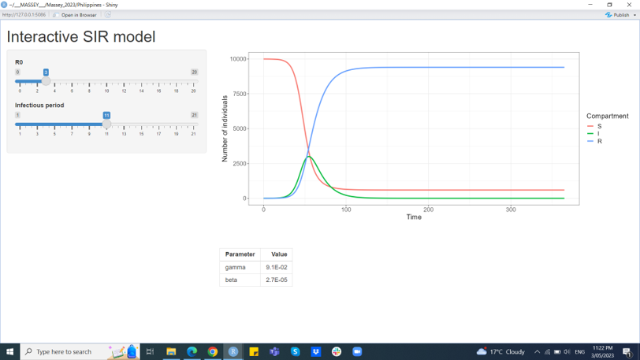

```{r setup, include=FALSE}
knitr::opts_chunk$set(echo = TRUE)
```

```{r klippy, echo=FALSE, include=TRUE}
library(klippy)
klippy::klippy('')
```

## Session 4

**Session 4** contains an introduction to different types of models and when and why they are used.

### Session 4a - Introduction to different models

Models can be powerful tools. Models are conceptual frameworks or representations that allow us to understand or make predictions about aspects of the world in which we live. 

Models act as simplified versions of reality. They come in various forms, ranging from physical replicas to experimental systems to mathematical equations and computer simulations. By focusing on key variables and relationships, models enable us to analyze and begin to understand systems that are otherwise too complex.

One of the key strengths of models lies in their ability to make predictions. By understanding the relationships and interactions between different variables within a model, we can make educated guesses about the behavior of the corresponding real-world system. These predictions provide us with valuable insights and help us anticipate future outcomes or consequences.

Models also allow us to explore "what if" scenarios and conduct experiments in a controlled and cost-effective manner. By manipulating different parameters or assumptions within a model, we can examine how changes in one aspect affect the overall system. This allows us to test hypotheses, evaluate alternative strategies, and inform decision-making processes.

However, it is important to recognize that models are simplifications and approximations of reality. While they offer valuable insights, they are not infallible. Models involve assumptions and limitations, and their accuracy depends on the quality of the data and the appropriateness of the underlying assumptions. It is essential to critically evaluate and validate models, acknowledging their strengths and weaknesses.

Despite their limitations, models have revolutionized our understanding of the world and shaped numerous fields, ranging from physics and economics to biology and climate science. They enable us to explore complex systems, uncover hidden patterns, and make informed decisions in a wide range of contexts.

In summary, models serve as invaluable tools in simplifying and understanding the world. By distilling complex phenomena into manageable representations, they enable us to predict, explore, and gain insights that would otherwise remain hidden. 

### 4b - - Introduction to Statistical models

Statistical models are powerful tools that allow us to understand and analyze data. They are mathematical representations of real-world phenomena, which help us to make predictions and draw conclusions based on data. 

These models use **probability theory** and **statistical inference** to quantify the relationships between different variables in a dataset. 

Statistical models can be used for a variety of purposes, such as forecasting future trends, understanding the impact of different factors on an outcome, or identifying patterns in data.

A statistical model consists of several components, each of which plays a crucial role in capturing the relationships between the variables in a dataset. These components include:

The **response variable** which is the variable that we are interested in predicting or explaining. It is also known as the **dependent variable**.

The **predictor variables** are the variables that we use to predict or explain the response variable. They are also known as **independent variables**.

The **parameters** are the unknown quantities that we estimate from the data to describe the *relationships* between the *response variable* and the *predictor variables*.

The **error term** is the part of the response variable that cannot be explained by the predictor variables. It is also known as the **residual** or **noise**.

Let's import our newly created and saved serology data set, **example_data.csv** and begin:

```{r, class.source='klippy'}
library(tidyverse)
example_data <- read.csv("data/example_data.csv")
glimpse(example_data)
```

Remember that if the data folder is not in the current working directory, we can specify the full file path instead:

```{r, class.source='klippy'}
#example_data <- read.csv("C:/Users/username/Documents/data/example_data.csv")
```

Note that R has again R has imported the data and made the text as *character* data types when we want some as dates and some as factors. Let's change those:

```{r, class.source='klippy'}
example_data <- example_data %>%
  mutate_at(vars("Cohort", "Sex", "Result.Beckman", "Result.Roche"), as.factor)
example_data <- example_data %>%
  mutate_at(vars("Date.of.birth","Date.of.symptoms","Date.of.PCR.test","Date.of.blood.sample"), ~ as.Date(., format = "%Y-%m-%d"))

glimpse(example_data)
```

Note we had to change the **as.Date()** format to *"%Y-%m-%d"*

Now we might want to work out if *antibody titres* are dependent on *age* and *sex*. We can choose one measure as the **response variable**; let's choose *IgG_S*.

```{r, class.source='klippy'}
print(example_data$IgG_S)
```

This is continuous numeric data.

The **predictor variables** we want here in this example are *Sex* and *Age*.

```{r, class.source='klippy'}
print(example_data$Age)
print(example_data$Sex)
```

These are *integer* and *factor* data types.

The *parameters* of the model will tell us how the *IgG_S* changes in relation to these *predictors* in our data set. Here we will use a **linear regression model** as an example:

```{r, class.source='klippy'}
lm(IgG_S ~ Age + Sex, data = example_data)
```

We can look at the *residuals* by using this:

```{r, class.source='klippy'}
lm(IgG_S ~ Age + Sex, data = example_data)$residuals
```

Or we can simplify this to:

```{r, class.source='klippy'}
model1 <- lm(IgG_S ~ Age + Sex, data = example_data)
model1$residuals
```

These become important later.

Now let's look at the **statistical equation** of a *simple linear model* like we used above. This can be written as:

$$
y = \beta_0 + \beta_1 x + \epsilon
$$

where **$y$** is the **response variable**, **$x$** is the **predictor variable**, **$\beta_0$** is the **intercept**, **$\beta_1$** is the *slope*, and **$\epsilon$** is the *error* term.

We will use some R code to plot this with some values. We will create a *data frame* called *df*, a model called *m*, a plot called *p* and an equation called *eq*:

```{r, class.source='klippy'}
# Create a ggplot of the data with the linear regression line
library(ggplot2)

df <- data.frame(x = c(1:100))
df$y <- 2 + 3 * df$x + rnorm(100, sd = 40)

m <- lm(y ~ x, data = df)

p <- ggplot(data = df, aes(x = x, y = y)) +
                geom_smooth(method = "lm", formula = y ~ x) +
                geom_point() +
  ylab(expression(paste("Dependent Variable (",  italic(y), ")")))+
  xlab(expression(paste("Independent Variable (", italic(x), ")")))+
  ggtitle("Example of a linear model")
p

eq <- substitute(italic(y) == a + b %.% italic(x)*","~~italic(r)^2~"="~r2,
                list(a = format(coef(m)[1], digits = 2),
                     b = format(coef(m)[2], digits = 2),
             r2 = format(summary(m)$r.squared, digits = 2)))

dftext <- data.frame(x = 70, y = 50, eq = as.character(as.expression(eq)))

p + geom_text(aes(label = eq), data = dftext, parse = TRUE)
```

In this code, we first load the **ggplot2** package. We then create example data for a simple *linear model* with a *true intercept* of 3 and a *true slope* of 2 using the **rnorm()** function to *add some random noise*. We then **fit** a linear model to the data using the **lm()** function.

Next, we create a ggplot of the data with the linear regression line using the **ggplot()** function and the **geom_point()** and **geom_smooth()** functions. 

The **method = "lm"** argument is used to fit a linear model to the data and *add the regression line*. We have a **confidence interval** in *grey* around the line, but could remove that using the *se = FALSE* argument. 

The **ggtitle()**, **xlab()**, and **ylab()** functions are used to add a title and axis labels to the plot.

Finally, we use some additional code to annotate the plot and add labels to the plot for the intercept and slope values. We will not go into that for now. The resulting plot will have the intercept and slope values added to the equation.

Note the **R<sup>2** is the R-squared, a statistical measure commonly used to assess the *goodness of fit* of a linear regression model. 

Specifically, **R<sup>2** quantifies the proportion of the total variation in the dependent variable (the outcome being predicted) that is accounted for by the linear regression model. It ranges from 0 to 1, where 0 indicates that the model explains none of the variance in the dependent variable, and 1 indicates that the model explains all of the variance.

But R is very flexible, so we can write some code to both perform a model and plot the results. Here is an example using our *example_data*:

```{r, class.source='klippy'}
ggplotRegression <- function(fit){
  
  require(ggplot2)
  
  ggplot(fit$model, aes_string(x = names(fit$model)[2], y = names(fit$model)[1])) + 
    geom_point() +
    stat_smooth(method = "lm", col = "red")
}

ggplotRegression(lm(IgG_S ~ Age, data = example_data))
```

Now let's add some text:

```{r, class.source='klippy'}
ggplotRegression <- function(fit){
  
  require(ggplot2)
  
  ggplot(fit$model, aes_string(x = names(fit$model)[2], y = names(fit$model)[1])) + 
    geom_point() +
    stat_smooth(method = "lm", col = "red") +
    labs(caption = paste("adj R2 = ",signif(summary(fit)$adj.r.squared, 2),
                       "intercept =",signif(fit$coef[[1]],2 ),
                       " slope =",signif(fit$coef[[2]], 2),
                       " p-value =",signif(summary(fit)$coef[2,4], 2)))
}

ggplotRegression(lm(IgG_S ~ Age, data = example_data))
```

The results of this would suggest that in our example data set age does not significantly affect the IgG anti-spike antibody titre, but remember there is a lot going on here and we need to consider other biological factors.

These models can be developed to attempt to understand lots of different processes and include factors such as **space** and **time** but we will come back to these later.

###  4c - Introduction to mechanistic, mathematical models

Mathematical models are tools used to represent real-world phenomena using *mathematical equations*, formulas, and relationships. These models are used to help understand complex systems and make predictions about their behavior under different conditions. Mathematical models help us test hypotheses, design experiments, and make decisions based on data-driven insights. Mathematical models can range from simple equations to highly complex simulations, and their effectiveness depends on how well they capture the relevant aspects of the real-world system being modeled. Overall, mathematical models are powerful tools for understanding and predicting the behavior of complex systems.

The **SIR** *epidemiological model* is a mathematical model used to study the spread of infectious diseases. It is named after the three compartments it divides a population into: **susceptible (S)**, **infected (I)**, and **recovered (R)**. The model **assumes** that every member of a population is either susceptible, infected, or recovered and cannot move between these compartments except through infection and recovery, but these assumptions can be changed. 

By analyzing the rates of infection and recovery, the SIR model can help researchers understand how diseases spread and how to control them. The SIR model has been widely used to study a variety of infectious diseases, including influenza, measles, and HIV/AIDS, along with models of bat infectious diseases.

#### The "SIR" model

In the simplest SIR model we assume there are no births or deaths (i.e. demography). 

We assume susceptible individuals (S) become infected and move into the infected class (I). 

After some period of time, infected individuals recover and move into the recovered (or immune) class (R). 

Once immune, they remain so for life, i.e. they do not leave the recovered class because there is no loss of immunity. 

The corresponding equations are given by
$$dS/dt = -β*S*I$$
$$dI/dt = β*S*I - γ*I$$
$$dR/dt = γ*I$$

where S,I, and R are the numbers of susceptible, infected, and recovered individuals in the population. 

Suppose the unit of time we are considering is days, then:
* $β$ is the **transmission rate**
* $βSI$ is the number of susceptible individuals that become infected per day;
* $γ$ is the recovery rate, and;
* $γI$ is the number of infected individuals that recover per day;
* $1/γ$  is the infectious period i.e. the average duration of time an individual remains infected.

#### Reproduction number, $R_0$

An important quantity of any disease model is the the **reproductive number, $R_0$**, which represents the average number of secondary infections generated from one infectious individual in a completely susceptible population. 

For the SIR model, $R_0=βN/γ$, where $N=S+I+R$ is the total (constant) population size. 

Since $R_0$ and the infectious period are more intuitive parameters, we use these as inputs for the built-in SIR model. We can then calculate $β$ as:

$$β=R_0γ/N$$
  
Lastly, $R_0$ is a special case of $R_eff$, the effective reproduction number, which is when there is immunity in the population, i.e. the population is not totally naive.

### Running dynamics models

We have seen for to run some *statistical models* above. Now let's look at how to run some mathematical models. 

We will start with the simple SIR model. Here's an example code in R to simulate an SIR model using the differential equations provided above:

```{r, class.source='klippy'}
## Load deSolve package
library(deSolve)

## Create an SIR function
sir <- function(time, state, parameters) {

  with(as.list(c(state, parameters)), {

    dS <- -beta * S * I
    dI <-  beta * S * I - gamma * I
    dR <-                 gamma * I

    return(list(c(dS, dI, dR)))
  })
}

### Set parameters
## Proportion in each compartment: Susceptible 0.999999, Infected 0.000001, Recovered 0
init       <- c(S = 1-1e-6, I = 1e-6, R = 0.0)
## beta: infection parameter; gamma: recovery parameter
parameters <- c(beta = 1.4247, gamma = 0.14286)
## Time frame
times      <- seq(0, 70, by = 1)

## Solve using ode (General Solver for Ordinary Differential Equations)
out <- ode(y = init, times = times, func = sir, parms = parameters)
## change to data frame
out <- as.data.frame(out)
## Delete time variable
out$time <- NULL
## Show data
head(out, 10)

## Plot
matplot(x = times, y = out, type = "l",
        xlab = "Time", ylab = "Proportion of the population", main = "SIR Model",
        lwd = 1, lty = 1, bty = "l", col = 2:4)

## Add legend
legend(40, 0.7, c("Susceptible", "Infected", "Recovered"), pch = 1, col = 2:4, bty = "n")
```

This code uses the **deSolve** package in R to simulate the **SIR model**. There are actually many ways that this can be done, but here this happens to use the **Runge-Kutta** method.

The **dS**, **dI**, and **dR** functions define the differential equations for the model.

The **ode()** function *integrates the equations over time* to produce the simulated population sizes for each time step. 

The final **matplot()** command generates a plot of the results, showing the number of susceptible, infected, and recovered individuals over time. Here we just used the *base* **matplot()** functions.

Now we are going to install a **Shiny** app, which is an interactive document that has a user interface. Note this might take some time to install.

```{r, class.source='klippy'}
#install.packages("shinySIR")
```

```{r, class.source='klippy'}
library(shinySIR)
#run_shiny(model = "SIR")
```

This should produce an **interactive gui** that looks similar to this:



From here, you can try altering the parameters and seeing how the results change.

There are other tools that you can use to explore SIR-based models. Here are some links:

https://www.epidemix.app/

http://covidsim.eu/

Let's open http://covidsim.eu/ and take a look at the models.
